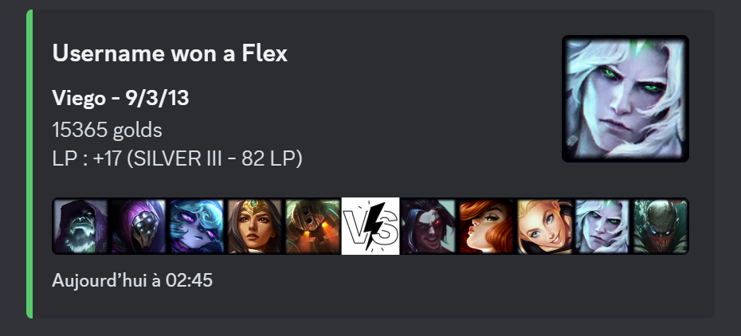
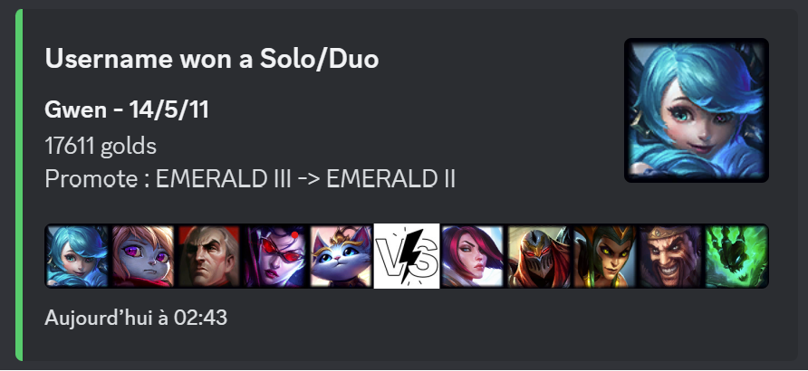

<h1>Images</h1>

<h1> SpyGame-Discord-bot - EN</h1>
<h4>Summary:</h4>

This bot allows you to view the results of League of Legends games for anyone as long as you have their username. After each game ends, the bot sends a message containing a summary of the game.

<h4>Details:</h4>

I am not a professional developer.
 
I am providing you with code that allows you to operate a Discord bot. I will not explain how to create one.
 
The bot and the database are not intended to track a large number of players. The bot can support about ten people by default, but you can increase it to 20 - 25 if you optimize the code.
 
Finally, the biggest drawback of the bot is the need to obtain a "personal" or "production" API key. The "personal" key is the one I recommend. It does not unlock the maximum request limit, but it is the easiest to obtain. Personally, I obtained it in just under two weeks by linking this GitHub project.

<h3>Required Python Libraries:</h3>

* Python 3.11
* discord
* os
* cloudinary
* matplotlib.image
* numpy
* requests
* json
* datetime
* apscheduler

<h3>Required APIs:</h3>

* Riot Games
* Discord
* cloudinary

<h2>Preparation</h2>

For the Riot Games API, you will need to request a product or personal key on their website: <a>https://developer.riotgames.com/</a> 

For the Discord API, you need to set up a bot. This is explained, for example, in the Pycord documentation: <a>https://guide.pycord.dev/introduction</a>

Finally, I use cloudinary to store images on the Internet. This allows me to include them in Discord "embed" messages. Just create a free account: <a>https://cloudinary.com/</a> 

<h2>Installation</h2>

Clone the GitHub repository and fill in the 'apiKeys.json' file located in the data folder.
It is constructed as follows:  
{  
"discord": "key",  
"riot":"key", 
"cloudinary" : { 
"cloud_name" : "name_cloud", 
"api_key" : "key", 
"api_secret" :"key" 
} 
} 
You need to replace the 'key' with the corresponding API keys (Discord calls this a Token). Note that API keys are sensitive data.

<h2>Launch</h2>

Run the main.py file with Python. The bot should appear as connected. Commands may take a bit of time to appear.

As for how the bot works, I'll let you look at the code in main.py. I've commented on the main functions in English, but more detailed comments are in French (sorry).

<h2>Commands:</h2>
<ul>
    <li><b>/add</b> "username" "channel"  Adds you to the bot's database. This means that as soon as you play a game, the result will be sent to the Discord channel you specified.</li>
    <li><b>/remove</b> "username" Removes your username from the database (along with all associated information). Autocompletion is available for all usernames in the database. </li>
    <li><b>/list</b> Displays a list of usernames stored in the database.</li>
    <li><b>/ping</b> Displays the bot's latency.</li>
    <li><b>/start_recap</b> "channel" Activates a weekly recap every Sunday at 8 p.m. in the "channel" channel</li>
    <li><b>/stop_bot or /start_bot</b> Stops or starts the search for a new match for all players in the database. The recap of the week remains activated.</li>
</ul>

"username" corresponds to your in-game summoner name, not necessarily your Riot ID, which may be different.

********************
<h1> SpyGame-Discord-bot - FR</h1>

<h4>Résumé :</h4>

Ce bot permet de voir le résultat des parties de LoL de n'importe qui tant que vous avez son pseudo. À chaque fin de game le bot envoie un message contenant un résumé de la partie

<h4>Précisions :</h4>

Je ne suis pas un développeur pro.
 
Je vous fournit un code qui vous permet de faire fonctionner un bot discord. Je ne vous explique pas comment en créer un.
 
Le bot et la base de données ne sont pas destinés à suivre une grande quantité de joueur. Le bot peut supporter de base une dizaine de personnes, mais vous pouvez augmenter jusqu'à 20 - 25 si vous optimisez le code.
 
Enfin, le plus grand inconvénient du bot est la nécessité d'obtenir une clé API "personal" ou "production". La clé "personal" est celle que je recommande. Elle ne débloque pas le plafond de requêtes maximums mais c'est la plus simple à avoir. Personnellement, je l'ai obtenu en un peu moins de deux semaines en mettant ce projet Github en lien.

<h3>Librairies pythons nécessaires :</h3>

* Python 3.11
* discord
* os
* cloudinary 
* matplotlib.image
* numpy
* requests
* json
* datetime
* apscheduler

<h3>API nécessaires :</h3>

* Riot Games
* Discord
* cloudinary

<h2>Préparation</h2>

Pour l'API de Riot Game, vous allez devoir demander une clé produit ou personnel sur leur site : <a>https://developer.riotgames.com/</a> 

Pour l'API de discord, vous devez mettre en place un bot. C'est expliqué par exemple ans la documentation de Pycord : <a>https://guide.pycord.dev/introduction</a>

Enfin, j'utilise cloudinary pour stocker des images sur Internet. Cela me permet de pouvoir les mettre dans les messages "embed" de Discord. Il suffit de créer un compte gratuit : <a>https://cloudinary.com/</a> 

<h2>Installation</h2>

Clonez le dépôt Github et remplissez le fichier 'apiKeys.json' qui se trouve dans le dossier data.
Il se construit de la manière suivante :  
{  
"discord": "key",  
"riot":"key", 
"cloudinary" : { 
"cloud_name" : "name_cloud", 
"api_key" : "key", 
"api_secret" :"key" 
} 
} 

Il vous faut remplacer les 'key' par les clés d'API correspondante (Discord appelle cela un Token). Attention, les clés d'API sont des données sensibles.

<h2>Lancement</h2>

Exécutez avec python le fichier main.py. Le bot doit s'afficher comme connecté. Les commandes peuvent mettre un peu de temps à apparaître.

Pour ce qui est du fonctionnement du bot, je vous laisse le soin de regarder le code dans main.py. J'ai commenté les fonctions principales en anglais, mais les commentaires plus précis sont en français (désolé).

<h2>Commandes :</h2>

<ul>
    <li><b>/add</b> "pseudo" "channel"  Vous ajoute à la base de données du bot. C'est-à-dire que dès que vous ferez une game, le résultat sera envoyer dans le channel discord que vous avez entrer.</li>
    <li><b>/remove</b> "pseudo" Supprime votre pseudo de la base de données (et toutes les informations qui vont avec elle). Une auto-complétion sur tous les pseudo de base de données est disponible. </li>
    <li><b>/list</b> Affiche la liste des pseudo enregistrés dans la base de données.</li>
    <li><b>/ping</b> Affiche la latence du bot.</li>
    <li><b>/start_recap</b> "channel" Active un recap hebdomadaire tout les dimanches à 20h dans le channel "channel"</li>
    <li><b>/stop_bot or /start_bot</b> Coupe ou lance la recherche de nouveau match pour tout les joueurs de la base données. Le recap de la semaine reste activé.</li>
</ul>

"pseudo" correspond à votre nom d'invocateur en jeu. Pas forcément à votre Riot ID qui peut-être différent.
